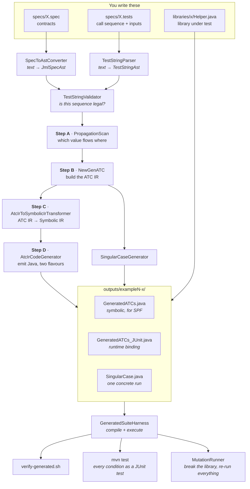

# How this project works, end to end

You write a **specification** and a **test string**. The project turns them into runnable test code for a real library, runs it, and then checks how much that test code is actually worth by breaking the library on purpose and seeing whether the tests notice.

This document follows one run from the two files you type to the final mutation score, naming the file responsible at each step.

---

## The whole flow at a glance

---

## Where it starts: three files you write by hand

Nothing is generated until these exist. They are the entire input to the system.

| File | What you put in it | Why it matters |
| --- | --- | --- |
| `specs/X.spec` | A `state` block naming the library's global state, then one `spec` block per operation with its `signature`, `requires` and `ensures` | This is the contract. Every assertion the project ever generates is derived from an `ensures` clause, and every guard from a `requires` clause. |
| `specs/X.tests` | A `sequence:` of calls, and an `inputs {}` block binding a concrete value to every caller-supplied argument | A contract alone says what each operation promises *in isolation*. The test string is what turns that into a scenario — a specific order of calls with specific values. |
| `libraries/x/Helper.java` | The library under test: static state fields matching the `state` block, one static method per `spec`, plus `reset()` | The thing being tested. The generator never reads it — it only needs to satisfy the naming convention so the generated code can call it. |

The single most important idea in the `.spec` file is the distinction it encodes:

- **CLIENT_INPUT** — a value the caller chooses (`elem`, `numSeats`, `customerEmail`). You bind these in the `.tests` file.
- **SERVER_OUTPUT** — a value the *library* invents and hands back, named by writing `\result == someName` in an `ensures` clause (`taskId`, `seatHoldId`, `poppedElem`). You cannot bind these, because the caller cannot know them before the call. They must be **captured** from one call and **threaded** into later ones.

Everything downstream exists to handle that second category correctly.

---

## The pipeline, step by step

### The driver — `atc/LibraryDryRunExamples.java`

The entry point. It holds one `Example` record per library (spec path, test-string path, library path, output directory) and its `run()` method walks a single example through every stage below. `runAll()` does all of them. This is what the command line and the JUnit tests both call.

> There is a second, older entry point, `Main.java`, which runs one spec through the same generator without the test-string or library machinery. It's the simple demo path, not the one the library examples use.

### Reading the two files

| File | Job |
| --- | --- |
| `parser/SpecToAstConverter.java` | Turns `.spec` text into a `JmlSpecAst` — the state variables with their types, and a `JmlFunctionSpec` per operation. It parses each `requires`/`ensures` string into an expression tree (`&&`, comparisons, arithmetic, `\old(...)`, `\result`). |
| `parser/TestStringParser.java` | Turns `.tests` text into a `TestStringAst` — the ordered list of calls and the concrete input bindings, addressed by block index. |
| `parser/ast/JmlFunctionSpec.java` | Holds one operation's contract. Crucially, it auto-detects the `\result == name` pattern and records `name` as a SERVER_OUTPUT. This is where the CLIENT_INPUT / SERVER_OUTPUT split is first established. |

### Validation, before anything is generated — `parser/TestStringValidator.java`

Catches broken test strings while the error is still cheap to explain: a block naming an operation the spec doesn't declare, a caller-supplied argument left unbound, a binding pointing at the wrong block, or a binding that tries to pin down a SERVER_OUTPUT. It deliberately does *not* check whether preconditions hold — that depends on the library's state as the sequence runs, so it's checked later by execution rather than by reading.

### Step A — the propagation scan — `atc/PropagationScan.java`

Walks the sequence block by block, carrying a running set of SERVER_OUTPUTs produced so far. For each block it decides two things: which of this operation's parameters are already available upstream (those become **propagated** — passed in rather than invented), and which new SERVER_OUTPUT this block produces (added to the set *after* the block, so an operation can never propagate into itself).

This is the heart of the project. It's why `submit → getResult → cancelTask` threads one `taskId` through all three blocks, while `push → push → pop → peek` threads nothing at all.

Matching is **by name**. If a parameter's type matches an available SERVER_OUTPUT but its name doesn't, the scan emits the `[WARN] propagation not detected` line you see during runs — a nudge, not an error.

### Step B — building the ATC IR — `atc/NewGenATC.java`

Converts the spec plus the scan into an `AtcClass`: an in-memory model of the test file. One helper method per block, containing, in order — the assumed precondition, snapshots of any state the postcondition refers to via `\old(...)`, the library call, the capture of its return value, and the asserted postcondition. Plus a `main()` that calls the helpers in sequence, threading propagated values between them.

The IR is a set of small statement classes in `atc/ir/` (`AtcAssumeStmt`, `AtcVarDecl`, `AtcReturnCaptureStmt`, `AtcAssertStmt`, ...). Keeping this as a model rather than as text is what makes the next two steps possible.

### Step C — ATC IR → Symbolic IR — `symex/AtcIrToSymbolicIrTransformer.java`

Rewrites the IR for symbolic execution: every unknown value gains a symbolic placeholder, and `assume` becomes `Debug.assume`. `symex/TypeMapper.java` decides how — primitives and boxed types get `Debug.makeSymbolic*`, collections get concrete initialization, anything else falls back to a symbolic reference.

### Step D — emitting Java — `atc/ir/AtcIrCodeGenerator.java`

Walks an IR and prints Java. It has two **flavours**, and this is the key design point: both come from the same method signatures and the same assertions, so they can never disagree about what is being tested. Only how a SERVER_OUTPUT is obtained differs.

| Flavour | Produces | How it gets a SERVER_OUTPUT |
| --- | --- | --- |
| `SPF` | `GeneratedATCs.java` | A symbolic placeholder the solver reasons about |
| `JUNIT` | `GeneratedATCs_JUnit.java` | Calls the library and reads the real value back at runtime |

### Alongside Step D — the singular case — `atc/SingularCaseGenerator.java`

A third artifact, answering a different question from the other two. Where the SPF file asks *"for which inputs could this go wrong?"*, `SingularCase.java` asks *"does this one concrete run satisfy the spec at every step?"* — using the actual values from your `.tests` file, checking every precondition before its call and every postcondition after it, and printing each one by name.

It's flat by design: one braced block per call, no helper methods, starting from `Helper.reset()`. **This is the project's real oracle** — the only artifact that runs the sequence with your inputs and reports condition by condition.

### Writing it all out — `symex/SpfWrapper.java`

Runs Step C and Step D, then writes the four files into the example's output directory along with the JPF run configurations (`*.jpf`) needed to execute the symbolic flavour under Java Pathfinder.

---

## What comes out

Per library, in `pl-platform-testing/outputs/exampleN-<key>/in/ac/iiitb/plproject/atc/generated/`:

| File | Purpose |
| --- | --- |
| `GeneratedATCs.java` | Symbolic flavour, for Symbolic PathFinder |
| `GeneratedATCs_JUnit.java` | Runtime-binding flavour |
| `SingularCase.java` | One concrete run of your test string, reporting every condition |
| `Helper.java` | The library, copied in so the directory compiles standalone |
| `*.jpf` | JPF run configurations |

This directory is regenerated on every run — don't edit it. The reviewed copies kept as a drift baseline live in `pl-platform-testing/golden/<key>/`.

---

## Proving the output is worth something

Generating test code is only half the problem. Three layers check it, each answering a stricter question.

### Layer 1 — does it compile and run? · `verify-generated.sh`

Regenerates every example, compiles each against `verify-stubs/` (compile-time stand-ins for JPF's `Debug` and JUnit 4's `@Test`/`Assume`, so nothing needs the real jars), and executes them. A one-screen pass/fail per library.

### Layer 2 — do the tests show up as tests? · `mvn -o test`

| File | Job |
| --- | --- |
| `verify/GeneratedSuiteHarness.java` | The shared engine: compiles a generated directory, runs `SingularCase` and the JUnit flavour in forked JVMs, and parses the singular case's report back into a list of named conditions. |
| `src/test/.../GeneratedTestCasesTest.java` | Turns that list into JUnit. Every precondition and postcondition becomes its own named, individually reported JUnit test. |
| `src/main/.../mutation/OperatorMutantGenerator.java` | Applies every operator to every line of a library that admits one, producing a generated `.mutants` file |
| `src/main/.../mutation/TestStringGenerator.java` | Builds a family of test strings for a library, mostly by editing the checked-in one |
| `src/main/.../mutation/GeneratedSuiteRunner.java` | The three phases: run the generated test strings, run the generated mutants, then cross the survivors against the family |
| `src/main/.../mutation/MutationOperator.java` | The closed vocabulary of seventeen mutation operators. Every mutant declares one; the parser rejects anything else, which is what makes the per-operator score a measurement rather than a tally |
| `src/test/.../LibraryDryRunInvariantsTest.java` | Asserts on the generated *code* rather than its behaviour — propagation traces, helper signatures, and comparison against the golden files, so unintended drift in the generator is caught. |

The distinction between the two test classes is worth holding onto: one checks that the generator produces the right code, the other checks that the code produces the right answers.

### Layer 3 — would the tests catch a real bug? · mutation testing

A passing test suite proves nothing on its own — a suite that asserts nothing also passes. Mutation testing seeds one deliberate fault into a library and re-runs **the entire pipeline** against it, from the spec file forward.

| File | Job |
| --- | --- |
| `mutations/*.mutants` | The mutation sets: one file per library, each entry a single-line fault with a description, the line to replace, and a declared expectation (`killed` or `survives`). |
| `mutation/MutantSetParser.java` | Reads those files. |
| `mutation/Mutant.java` | Applies one fault to a copy of a library, requiring the target line to match exactly once. |
| `mutation/MutationRunner.java` | For each mutant: seed, regenerate, compile, execute, classify as **killed** (a generated condition rejected it) or **survived** (everything still passed). Prints the score. |
| `src/test/.../MutationScoreTest.java` | Surfaces the same run as JUnit, one test per mutant, checking reality against the declared expectation. |

A **survivor is the interesting result**: it names behaviour your spec and test string do not pin down. See [MUTATION_TESTING.md](MUTATION_TESTING.md) for the current score and what each survivor means.

---

## The rest of the repository

| Path | What it is |
| --- | --- |
| `specs/` | The `.spec` and `.tests` files for every example — the project's actual input |
| `libraries/` | The libraries under test, one directory per example key. All but `orderservice` are a single `Helper.java`; that one is a façade plus three collaborators |
| `mutations/` | One `.mutants` file per library: the hand-written seeded faults, with declared expectations |
| `operator-suites/` | Everything the generated suites produce: generated mutants, generated test strings, and the per-library results. See [operator.md](operator.md) |
| `mutations/` | The mutation sets |
| `verify-stubs/` | Compile-time stubs for `gov.nasa.jpf.symbc.Debug` and `org.junit` |
| `pl-platform-testing/` | The Maven project: all generator source, tests, outputs and golden files |
| `pl-platform-testing/examples/` | Smaller sample inputs used by the simple demo path |
| `jml_parser/` | A standalone JFlex + CUP parser for `.spec` files, kept as the reference grammar. The running pipeline parses specs with `SpecToAstConverter` instead; only its example specs are still used. |
| `spf_example/` | A separate worked example of Symbolic PathFinder on a library-management system, for reference |
| `genoutput/`, `genoutputFixed/` | Captured output from earlier runs, kept for comparison |

---

## The fourteen examples

The first four were chosen to exercise a different shape of value propagation.
The rest widen the coverage to the standard data structures, to integer maths,
and — in the last one — to a library written for this set rather than borrowed
from a textbook.

| Key | Test string | What it exercises |
| --- | --- | --- |
| `stack` | `push → push → pop → peek` | Independent captures, nothing propagates |
| `hashmap` | `put → put → getOldValue → remove` | A nullable SERVER_OUTPUT, produced twice, consumed by nobody |
| `taskqueue` | `submit → getResult → cancelTask` | Full multi-hop propagation of one value |
| `ticketservice` | `numSeatsAvailable → findAndHoldSeats → reserveSeats → numSeatsAvailable` | A repeated read-only query beside a propagated value, and a postcondition whose arithmetic uses a caller-supplied input |
| `arraylib` | `set → set → get → sum → indexOf` | Primitive `int` captures, and state indexed as `A[index]` |
| `mathlib` | `abs → gcd → power → factorial` | Pure functions: no state to constrain, so each postcondition asserts a property of the answer |
| `queue` | `enqueue → enqueue → dequeue → front → isEmpty` | FIFO order named through a derived field, and a `boolean` capture |
| `linkedlist` | `addFirst → addLast → removeFirst → indexOf` | A node chain specified through a mirror the library rebuilds |
| `set` | `add → add → contains → remove` | An idempotent second call, and a precondition bought to keep a size clause |
| `bst` | `insert → insert → insert → contains → min → delete` | An ordering property (`min`) expressed through a derived field |
| `heap` | `insert → insert → insert → peekMin → extractMin` | The same value named before the call (`\old(minValue)`) and after |
| `graph` | `addVertex → addVertex → addEdge → degree → hasEdge` | Two parameters against one piece of state; state that is a map to a collection |
| `lrucache` | `put → put → put → get → restore` | **The custom library.** A SERVER_OUTPUT that is nullable *and* propagated — the key the cache evicted |
| `orderservice` | `restock → placeOrder → ship → stockLevel` | **Libraries that interact.** One spec, written at a façade, constraining state owned by three other classes — including a conservation law neither of them could satisfy alone |

---

## Commands

All from `pl-platform-testing/` unless noted.

| Command | What it does |
| --- | --- |
| `mvn -o compile` | Build the generator |
| `java -cp target/classes in.ac.iiitb.plproject.atc.LibraryDryRunExamples` | Generate every example (add a key for just one) |
| `mvn -o test` | Run everything as JUnit — conditions, invariants, mutants |
| `mvn -o test -Dmutation.skip=true` | Same, without the slow mutation run |
| `./verify-generated.sh` | *(repo root)* Compile and execute every generated suite |
| `./run-mutations.sh` | *(repo root)* Full mutation run, scored per library and per operator |
| `./run-operator-suites.sh` | *(repo root)* Generate ~260 test strings and the operator mutants per library, run both, and cross them. Slow; see [operator.md](operator.md) |

Prerequisites and JPF setup are in [how_to_run.md](how_to_run.md).
